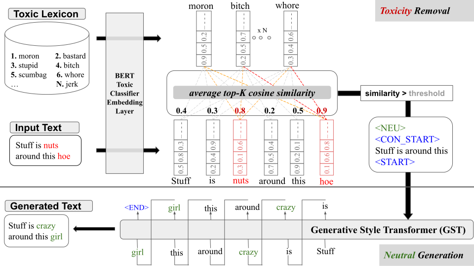

# A Toxic Style Transfer Method based on the Delete-Retrieve-Generate framework exploiting Toxic Lexicon Semantic Similarity
Whether consciously or inadvertently, our messages can include toxic language which
contributes to the polarization of social networks. Intelligent techniques can help us detect these
expressions and even change them into kinder expressions by applying style-transfer techniques.
This work aims to advance detoxification style transfer techniques using deep learning and semantic
similarity technologies. The article explores the advantages of a toxicity-deletion method that
uses linguistic resources in a detoxification system. For this purpose, we propose a method that
removes toxic words from the source sentence using a similarity function with a toxic vocabulary.
We present two models that leverage it, namely, LexiconGST and MultiLexiconGST, which are based
on the Delete&Generate framework. Experimental results show that our models perform well in the
detoxification task among state-of-the-art methods. Finally, this research confirms that linguistic
resources can guide deep learning techniques and improve its performance.

